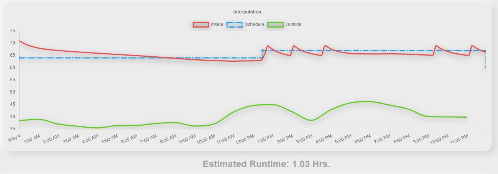
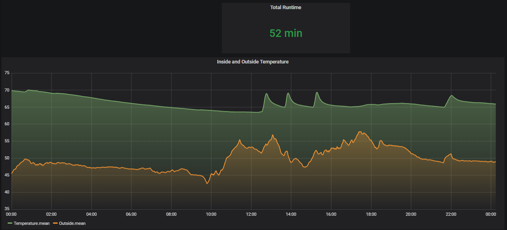

# Enxor-Smart-Thermostat
### By: Matthew Crump
---
## Contents
1. [Overview](#overview)
2. [Heating-Model](#heating-model)
3. [Cpp-Model](#cpp-model)
4. [API](#api)
5. [Configuration](#configuration)

---
## Overview
At my duplex, I used to have a simple thermostat that used a mercery switch. I wanted to improve this by making a smart thermostat that could have a different schedule for each day of the week. As a college student at the time of creation, my schedule varied day by day. Another feature I wanted was to have the termostat automatically turn down after I had been away for a certain amount of time. The feature that is most unique to this project is the ability to predict/estimate how long the furnace might run for, given local weather data and the set schedule. This gives the user feedback as to whether the set schedule is efficient or not. All the data captured by the termostat is saved to an Influx DB running on a Raspberry Pi 4 through a Node-Red interface.

---
## Heating Model
To provide the user with feedback on the schedule they have chosen for a given day, I created a model that will simulate how the thermostat might respond. The simulation takes in local weather data, the schedule for the day, and the starting temperature and calculates how long the furnace might run for. After tunning the model, I was able to achive estimates that were within 5 to 20 minutes of the actual runtime for that day. Typical days in the winter can have runtimes of over 3 hours.
Below is a screenshot of the simulated runtime.

Below is a screenshot of the actual recorded data.

A comprehensive explaination of the math can be found [here](docs/Heating-Model.ipynb). GitHub markdown does not allow for rendering of LaTex math equtions. Using a Jupyter notebook overcomes this problem. This also frees up this readme as the extensive explaination can be found there.

---
## Cpp Model
The Python implementation can be quite slow, around 100 ms per simulation. I've created a C++ version of the model using the Python Boost library. The C++ version runs about 10 times faster. This aids in server startup as all 7 days are simulated in one go and serving the clients when dates change.
### Using the C++ model for simulation
* To use the the C++ model a value of ```true``` must be set for ```use-cpp-sim``` in the JSON config file.
* You may need to install the following libaries:
  * libboost-all-dev
  * python3.8-dev (change to what version you have)
* Run the provided make file to build the ```.so``` file that will be used by the web server.

---
## API

### Day ID Endpoint
 * ```/getDayIDs```
 * Response
 <pre>{
  "fri": 30, 
  "mon": 195, 
  "sat": 40, 
  "sun": 192, 
  "thu": 54, 
  "tue": 67, 
  "wed": 48
}</pre>

### Day's Schedule Endpoint
 * ```/getCycles/<day>```
 * Response
 <pre>{
  "cycles": [
    {
      "h": 0, 
      "id": 219, 
      "m": 0, 
      "t": 60.0
    }, 
    {
      "h": 13, 
      "id": 218, 
      "m": 15, 
      "t": 65.0
    }, 
    {
      "h": 23, 
      "id": 220, 
      "m": 0, 
      "t": 65.0
    }
  ]
}</pre>

### Epoch Timestamp Endpoint
 * ```/getEpoch```
 * Response
 <pre>{
  "epoch": 1655233730
}</pre>

### Forecast Endpoint
 * ```/getForecast```
 * Response
 <pre>{
    "hourly": [
        {
            "i": 1,
            "t": 45
        },
        {
            "i": 1,
            "t": 43
        },
        {
            "i": 1,
            "t": 41
        },
        {
            "i": 1,
            "t": 37
        },
        {
            "i": 1,
            "t": 33
        },
        {
            "i": 0,
            "t": 30
        },
        {
            "i": 0,
            "t": 31
        },
        {
            "i": 0,
            "t": 36
        },
        {
            "i": 0,
            "t": 40
        },
        {
            "i": 0,
            "t": 43
        },
        {
            "i": 0,
            "t": 47
        },
        {
            "i": 0,
            "t": 51
        },
        {
            "i": 0,
            "t": 56
        },
        {
            "i": 0,
            "t": 59
        },
        {
            "i": 0,
            "t": 63
        },
        {
            "i": 0,
            "t": 66
        },
        {
            "i": 0,
            "t": 68
        },
        {
            "i": 0,
            "t": 69
        },
        {
            "i": 0,
            "t": 68
        },
        {
            "i": 8,
            "t": 59
        },
        {
            "i": 8,
            "t": 52
        },
        {
            "i": 9,
            "t": 47
        },
        {
            "i": 9,
            "t": 49
        },
        {
            "i": 9,
            "t": 50
        },
        {
            "i": 9,
            "t": 48
        }
    ],
    "daily": [
        {
            "d": 2,
            "i": 8,
            "H": 62,
            "L": 30
        },
        {
            "d": 3,
            "i": 0,
            "H": 70,
            "L": 40
        },
        {
            "d": 4,
            "i": 0,
            "H": 92,
            "L": 60
        },
        {
            "d": 5,
            "i": 8,
            "H": 93,
            "L": 59
        }
    ]
}</pre>

### Temporary Temperature Endpoint
 * ```/getTemporary```
 * Response
  <pre>{
  "temporary": 0.0
}</pre>

---
## Configuration
Refer to the ```config-sample.json``` for the list of properties that can be set. This file should be renamed to ```config.json``` as that is the name the server looks for on startup.
* Property descriptions:
  | Name | Description | 
  | --------- | --------- |
  | ```thermostat-hostname``` | Hostname that the server will look for on the network to obtain its IP address |
  | ```thermostat-hb-port``` | Thermostat port to receive heartbeat messages on |
  | ```thermostat-listen-port``` | Thermostat listening port for udp messages  |
  | ```max-settable-temperature``` | The maximum settable temperature by the user |
  | ```min-settable-temperature``` | The minimum settable temperature by the user |
  | ```api-key``` | The api key for the weather api service you are using |
  | ```lat``` | Your lattitude in degrees |
  | ```lon``` | Your longitude in degrees |
  | ```use-cpp-sim``` | If the C++ simulation model should be used instead of the Python implementation |
  | ```debug-enabled``` | If the server should start up in debug mode. API weather queries will be loaded from archive files instead and debug statements will be logged |
  | ```time-zone-from-gmt``` | hourst from GMT time zone |
  | ```btu``` | BTU rating of furnace in thousands |
  | ```delta-time``` | Simulation time interval |
  | ```thresh-upper``` | Upper threshold for when the furnace should shut off |
  | ```thresh-lower``` | Lower threshold for when the furnace should turn on|
  | ```sample-avg``` | Number of samples of the air temperature should be used to calculate the average temperature in the air. |
  | ```k1``` | The wall insulation factor |
  | ```k2``` | The ceiling insulation factor |
  | ```k3``` | The roof insulation factor |
  | ```f1``` | Factor for how much sunlight heat is transfered through to the walls |
  | ```f2``` | Factor for how much sunlight heat is transfered through to the roof |
  | ```rolling-avg-size``` | The heat capacity of the establisment. Larger numbers mean that the temperature inside will be more resistant to change by the furnace or the outside temperature. This is a way to simulate furnature, walls etc retaining heat (whether that is cooler or warmer than the current temperature) |
